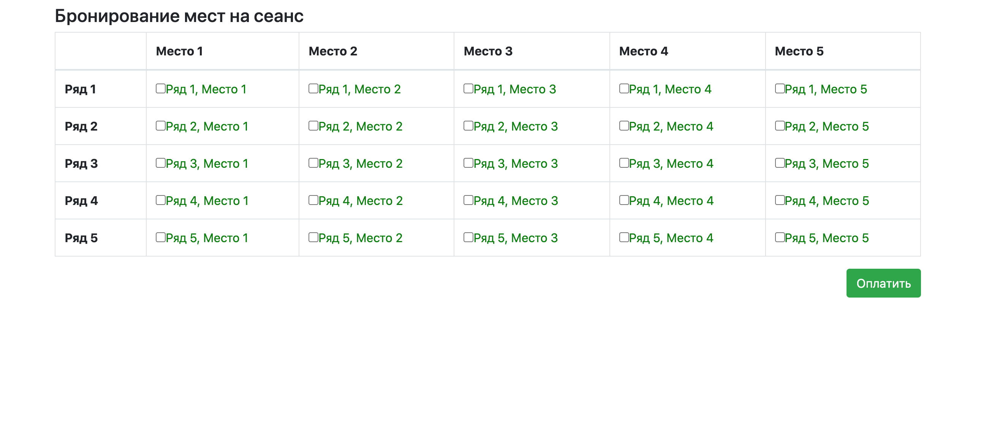
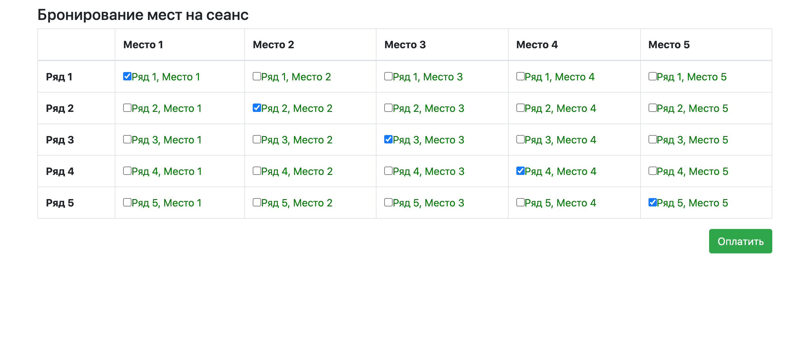
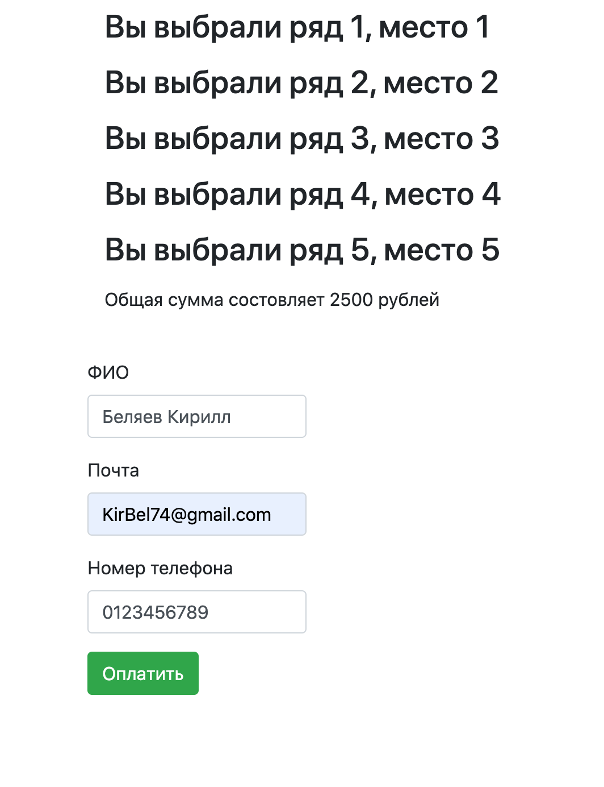
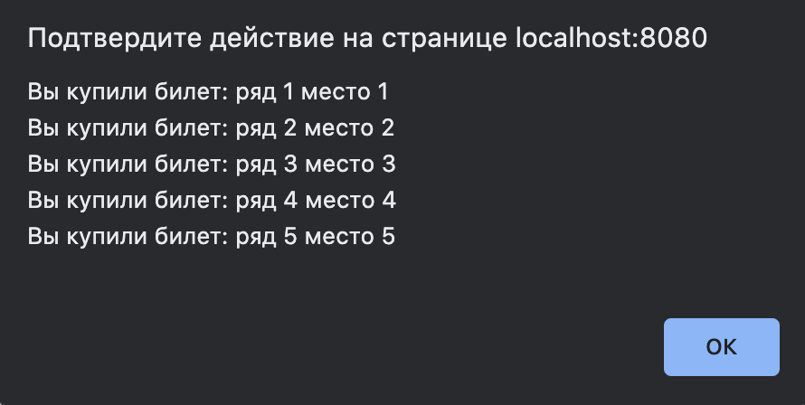
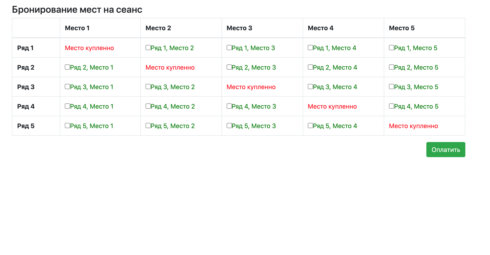
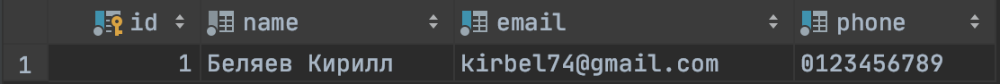
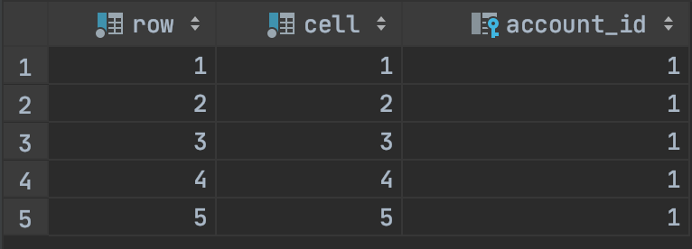

## Проект курса [job4j](http://job4j.ru)

### Кинотеатр
Каждые 30 секунд главная страница обновляеться.
Технологии:
- PostgresSQL
- JS / Jquery
- Apache Tomcat
- Log4j
- Singleton (On Demand Holder Idom)

Зал в кинотеатре

Клиент выбирате места

Оплата билетов

Подтверждение покупки билетов

Места купленны

